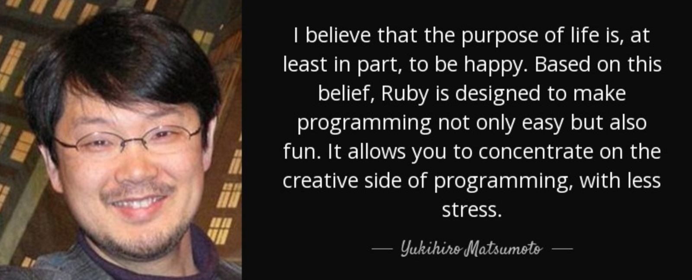
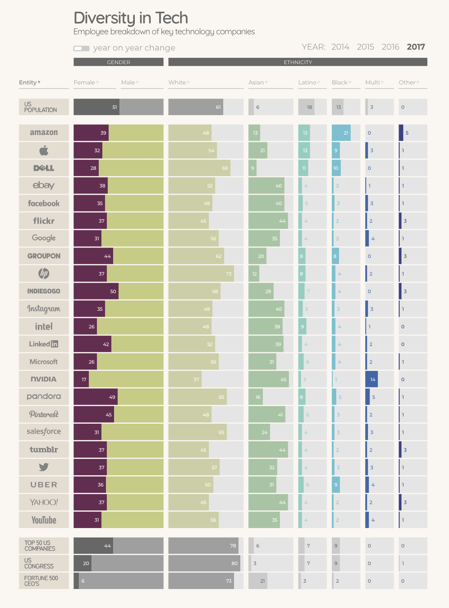

# Should We Code in English?

My background, before entering the world of data science, was as a linguist. I studied everything from Bahasa Melayu to Zulu, so I well know the rich variety of grammars and syntaxes that exist in human languages.

Yet although the capacity for linguistic fluency is our shared human birthright, one of the highest barriers to entry for aspiring data scientists is acquiring the language needed to talk to computers––the language of code. Consider the following:

```JavaScript
var languages = ["Amharic", "Catalan", "Finnish",
"German", "Swazi", "Uzbek"];
var text = "";
var i;
for (i = 0; i < languages.length; i++) {
  text += languages[i] + "<br>";
}
```  
Someone who speaks English but isn't trained in computers would not immediately intuit what this code is doing.

What's interesting to a linguist is how programming languages fall on a spectrum, from the extremely rigid and opaque to the nearly conversational. JavaScript (above) is on the decidedly non-natural end of formal languages; pure Python falls more towards the other side:

```Python
languages = ["Amharic", "Catalan", "Finnish",
"German", "Swazi", "Uzbek"]
text = ""
for language in languages:
  text += language + "\n"
```

Even someone with very little programming experience could at least take an educated guess at what's happening here and not be entirely wrong.

Both for loops produce the same output. Both languages are Turing-complete. But one is intuitively more accessible to beginners from a purely linguistic standpoint than the other.

## Lowering The Barriers to Entry for Computer Programming

<figure style="width: 700px">
	
	<figcaption>Yukihiro Matsumoto on implementation choice in Ruby</figcaption>
</figure>

In a world dominated by data and computers, the ability to manipulate both is an increasingly vital skill. There's a growing knowledge gap––and, consequently, an income gap––between those who can and those who can't.

Programming languages that allow non-programmers to access the tools of computer science are therefore hard to overvalue. Take R, for instance. As a programming language, it is an oddball. You can achieve the same ends using [many different strategies](https://www.quora.com/Who-uses-the-R-programming-language-and-how-do-they-use-it-Why-is-it-different-and-what-kind-of-programmer-would-be-interested-in-learning-R-language) (violating the [Zen of Python](https://www.python.org/dev/peps/pep-0020/), which states "There should be one-- and preferably only one --obvious way to do it.").

But this provides a great advantage to statisticians, research scientists, and others who need to analyze data on the fly: ["It allows statisticians to do very intricate and complicated analyses without knowing the blood and guts of computing systems."](https://www.nytimes.com/2009/01/07/technology/business-computing/07program.html)

It's also free and open-source, which means anyone with a computer and some moxie can download it, learn it, and connect with its considerable user base. That's great news for populations who are traditionally underrepresented in tech, especially [women](https://rladies.org/), for whom the R community has proven a [bastion of gender diversity](https://technical.ly/philly/2018/01/03/r-ladies-philly-meetup/). It also means you don't need to spend money or have any specialized education beyond basic computer literacy to get started learning it.

<figure style="width: 900px">
	
	<figcaption>Diversity in Tech, InformationIsBeautiful.net</figcaption>
</figure>

Human brains can do things computers cannot do––like recognize that ewes, does, lionesses, hens, and sows are all female animals. Our cognition means that our language can afford to be less literally precise and more metaphorical. (A computer would need, say, explicit XML tags and attributes to achieve the same categorization.) At some point, then, every serious programmer will need to learn things like regular expressions and formal syntactic conventions.

But why _start_ with those? Breaking into tech is hard enough as it is, especially if you're not well-off, white, and male. [Google's 2019 diversity report](https://www.forbes.com/sites/janicegassam/2019/04/07/googles-2019-diversity-report-reveals-more-progress-must-be-made/#419ead3a3bef) revealed a decline in women and minorities in leadership positions, down from an already low 29.4% to 25.7% for women. Only 25.7% of new tech hires in 2018 were not men. [Eighty-three percent of tech executives](https://www.techrepublic.com/article/5-eye-opening-statistics-about-minorities-in-tech/) are white. Accessibility to computer science education is a serious problem even for the relatively privileged––colleges [are capping computer science majors due to high demand](https://www.nytimes.com/2019/01/24/technology/computer-science-courses-college.html), further widening the inequality gap.

## Building a Foundation for Abstraction

<figure style="width: 700px">
	
	<figcaption>"A new, a vast, and a powerful language is developed for the future use of analysis . . . . [N]ot only the mental and the material, but the theoretical and the practical in the mathematical world, are brought into more intimate and effective connection with each other." - Ada Lovelace.</figcaption>
</figure>

Once someone has acquired the patterns of algorithmic thinking that underlie computer programming, they'll be able to apply them to any programming language. So why not start with a language that makes it easy and natural to learn those concepts, rather than frustrating?

The founder of Flatiron School underscores this point, noting that what's important isn't the first language you learn, but [learning how to learn](https://medium.com/learn-love-code/why-teach-ruby-bac8416c77ba), acquiring universal ideas, and learning to apply them to all kinds of different contexts. The language is almost immaterial; coding can even be taught [using blocks](https://www.theinquirer.net/inquirer/news/2463065/google-introduces-project-bloks-to-teach-coding-through-physical-objects) and [real-world objects](https://dynamicland.org/).

In truth, all programming languages are abstractions that allow people to indirectly write machine code, which is syntactically and semantically incomprehensible, by providing an interface that is more or less like natural human speech. It's not farfetched to think that [machine learning](https://hackernoon.com/its-time-we-code-in-english-e02df6b62ecc) might enable us to code directly [in English](https://www.geeksforgeeks.org/natural-language-programming/). For a beginning programmer, the closer to one's native tongue the programming language, the better. Anyone can learn the hard things eventually, but it's crucial to level the playing field for those starting out. Providing a bridge from plain English to computer-speak via hybrid languages that share characteristics of both seems a natural consequence of the growing ubiquity of coding as a required job skill.
