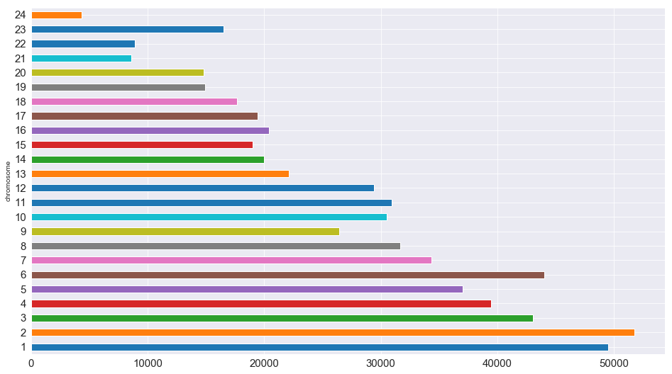
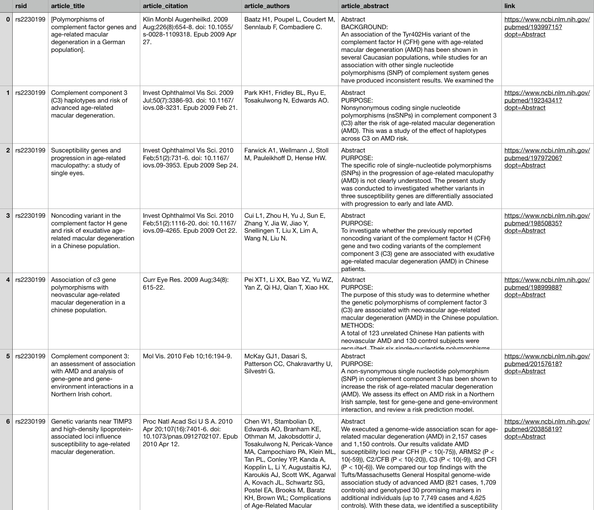

# Know Thyself: Using Data Science to Explore Your Own Genome
## DNA analysis with pandas and Selenium

<figure style="width: 900px">
	
	<figcaption>"Nosce te ipsum", ("know thyself"), a well-known ancient maxim, frequently associated with anatomical knowledge.</figcaption>
</figure>

[23andme](https://www.23andme.com/) once offered me a free DNA and ancestry test kit if I participated in one of their clinical studies. In exchange for my genetic data and a bunch of questionnaires, I got my genome sequenced and gained access to myriad reports on where my ancestors were likely from, what health conditions and traits I probably have inherited, and who else on the site I might be related to.

<figure style="width: 900px">
	
	<figcaption>Seriously?</figcaption>
</figure>

While 23andme provides an overwhelming amount of consumer-ready infographics and tools, I wondered what else I could do with the data. I knew I could download my raw genetic data from the site in a text file, so I decided to pour it into pandas and [see what I could make of it](https://github.com/lorarjohns/DNA_pandas_selenium). 


```python
%matplotlib inline
import seaborn as sns
sns.set_style('darkgrid')
sns.color_palette('Spectral')
import matplotlib.pyplot as plt
```


```python
import numpy as np
import requests
import pandas as pd

import re
```


```python
from selenium import webdriver
from selenium.webdriver.support.ui import WebDriverWait
```

## Importing my DNA into pandas and exploring the genome

Looking at the .txt file, I could see that I was missing some genotype values, which were denoted with '--'. 

While most of the chromosomes are ints, there are an X, a Y, and an MT (which I may convert later to a number for analytic purposes), but for now I need to make sure to specify the data type properly so that pandas doesn't throw an error when it sees mixed data in the input. 

The other columns are fairly straightforward. I also want pandas to ignore the prefatory comments at the beginning of the file that consist of lines beginning with an octothorpe.

The arguments I need to pass are:
* separator (tab-delimited)
* dtype (as a dict)
* na_values ('--')
* comment ('#')


```python
data = pd.read_csv('genome.txt', sep='\t', dtype={'rsid':'str', 'chromosome':'object', 'position':'int', 'genotype':'str'}, comment='#')


```


```python
print(data)
```

                   rsid chromosome  position genotype
    0       rs548049170          1     69869       TT
    1        rs13328684          1     74792       --
    2         rs9283150          1    565508       AA
    3           i713426          1    726912       --
    4       rs116587930          1    727841       GG
    5         rs3131972          1    752721       AG
    6        rs12184325          1    754105       CC
    7        rs12567639          1    756268       AA
    8       rs114525117          1    759036       GG
    9        rs12124819          1    776546       AA
    10       rs12127425          1    794332       GG
    11       rs79373928          1    801536       TT
    12       rs72888853          1    815421       --
    13        rs7538305          1    824398       AA
    14       rs28444699          1    830181       AA
    15          i713449          1    830731       --
    16      rs116452738          1    834830       GG
    17       rs72631887          1    835092       TT
    18       rs28678693          1    838665       TT
    19        rs4970382          1    840753       CT
    20        rs4475691          1    846808       CC
    21       rs72631889          1    851390       GG
    22        rs7537756          1    854250       AA
    23       rs13302982          1    861808       GG
    24      rs376747791          1    863130       AA
    25        rs2880024          1    866893       CC
    26       rs13302914          1    868404       TT
    27       rs76723341          1    872952       CC
    28        rs2272757          1    881627       AA
    29       rs35471880          1    881918       GG
    ...             ...        ...       ...      ...
    638501      i702582         MT     16399        A
    638502     i3001912         MT     16428        G
    638503      i705509         MT     16428        G
    638504     i3001918         MT     16463        A
    638505      i703465         MT     16463        A
    638506     i3001919         MT     16465        C
    638507      i702453         MT     16465        C
    638508     i4000619         MT     16468        T
    638509      i704237         MT     16468        T
    638510     i3001920         MT     16470        G
    638511      i703422         MT     16470        G
    638512     i3001921         MT     16471       --
    638513      i702337         MT     16471       --
    638514     i3001925         MT     16482        A
    638515      i708027         MT     16482        A
    638516     i3001926         MT     16483        G
    638517      i704927         MT     16483        G
    638518     i4000691         MT     16488        C
    638519      i706404         MT     16488        C
    638520      i706772         MT     16494        C
    638521     i3001927         MT     16497        A
    638522      i705833         MT     16497        A
    638523     i4000690         MT     16518        G
    638524      i701050         MT     16518        G
    638525      i701374         MT     16523        A
    638526     i4000693         MT     16524        A
    638527      i704756         MT     16524        A
    638528      i705255         MT     16525        A
    638529     i4000757         MT     16526        G
    638530      i701671         MT     16526        G
    
    [638531 rows x 4 columns]


A quick note on the column names:

* rsid stands for Reference SNP cluster ID. It identifies unique SNPs.

* SNPs are Single Nucleotide Polymorphisms ('snips'), locations in the genome that are known to vary between individuals. They can influence disease risk, drug efficacy and side-effects, tell you about your ancestry, and predict aspects of how you look and act.

* All humans have almost the same sequence of 3 billion DNA bases (A,C,G, or T) distributed between their 23 pairs of chromosomes. But at certain locations there are differences that have been reported to be meaningful, either medically or for other reasons (such as for genealogy). The SNPedia catalogues SNPs that have significant medical consequences, are common, are reproducible (or found in meta-analyses or studies of at least 500 patients), or have other historic or medical significance.

I started off by navigating my new data frame with some basic exploratory data analysis and data cleaning.


```python
# Read the data into a pandas DataFrame and do some EDA
df = pd.DataFrame(data)
```


```python
df.head(25)
```


<div>
<style scoped>
    .dataframe tbody tr th:only-of-type {
        vertical-align: middle;
    }

    .dataframe tbody tr th {
        vertical-align: top;
    }

    .dataframe thead th {
        text-align: right;
    }
</style>
<table border="1" class="dataframe">
  <thead>
    <tr style="text-align: right;">
      <th></th>
      <th>rsid</th>
      <th>chromosome</th>
      <th>position</th>
      <th>genotype</th>
    </tr>
  </thead>
  <tbody>
    <tr>
      <th>0</th>
      <td>rs548049170</td>
      <td>1</td>
      <td>69869</td>
      <td>TT</td>
    </tr>
    <tr>
      <th>1</th>
      <td>rs13328684</td>
      <td>1</td>
      <td>74792</td>
      <td>--</td>
    </tr>
    <tr>
      <th>2</th>
      <td>rs9283150</td>
      <td>1</td>
      <td>565508</td>
      <td>AA</td>
    </tr>
    <tr>
      <th>3</th>
      <td>i713426</td>
      <td>1</td>
      <td>726912</td>
      <td>--</td>
    </tr>
    <tr>
      <th>4</th>
      <td>rs116587930</td>
      <td>1</td>
      <td>727841</td>
      <td>GG</td>
    </tr>
    <tr>
      <th>5</th>
      <td>rs3131972</td>
      <td>1</td>
      <td>752721</td>
      <td>AG</td>
    </tr>
    <tr>
      <th>6</th>
      <td>rs12184325</td>
      <td>1</td>
      <td>754105</td>
      <td>CC</td>
    </tr>
    <tr>
      <th>7</th>
      <td>rs12567639</td>
      <td>1</td>
      <td>756268</td>
      <td>AA</td>
    </tr>
    <tr>
      <th>8</th>
      <td>rs114525117</td>
      <td>1</td>
      <td>759036</td>
      <td>GG</td>
    </tr>
    <tr>
      <th>9</th>
      <td>rs12124819</td>
      <td>1</td>
      <td>776546</td>
      <td>AA</td>
    </tr>
    <tr>
      <th>10</th>
      <td>rs12127425</td>
      <td>1</td>
      <td>794332</td>
      <td>GG</td>
    </tr>
    <tr>
      <th>11</th>
      <td>rs79373928</td>
      <td>1</td>
      <td>801536</td>
      <td>TT</td>
    </tr>
    <tr>
      <th>12</th>
      <td>rs72888853</td>
      <td>1</td>
      <td>815421</td>
      <td>--</td>
    </tr>
    <tr>
      <th>13</th>
      <td>rs7538305</td>
      <td>1</td>
      <td>824398</td>
      <td>AA</td>
    </tr>
    <tr>
      <th>14</th>
      <td>rs28444699</td>
      <td>1</td>
      <td>830181</td>
      <td>AA</td>
    </tr>
    <tr>
      <th>15</th>
      <td>i713449</td>
      <td>1</td>
      <td>830731</td>
      <td>--</td>
    </tr>
    <tr>
      <th>16</th>
      <td>rs116452738</td>
      <td>1</td>
      <td>834830</td>
      <td>GG</td>
    </tr>
    <tr>
      <th>17</th>
      <td>rs72631887</td>
      <td>1</td>
      <td>835092</td>
      <td>TT</td>
    </tr>
    <tr>
      <th>18</th>
      <td>rs28678693</td>
      <td>1</td>
      <td>838665</td>
      <td>TT</td>
    </tr>
    <tr>
      <th>19</th>
      <td>rs4970382</td>
      <td>1</td>
      <td>840753</td>
      <td>CT</td>
    </tr>
    <tr>
      <th>20</th>
      <td>rs4475691</td>
      <td>1</td>
      <td>846808</td>
      <td>CC</td>
    </tr>
    <tr>
      <th>21</th>
      <td>rs72631889</td>
      <td>1</td>
      <td>851390</td>
      <td>GG</td>
    </tr>
    <tr>
      <th>22</th>
      <td>rs7537756</td>
      <td>1</td>
      <td>854250</td>
      <td>AA</td>
    </tr>
    <tr>
      <th>23</th>
      <td>rs13302982</td>
      <td>1</td>
      <td>861808</td>
      <td>GG</td>
    </tr>
    <tr>
      <th>24</th>
      <td>rs376747791</td>
      <td>1</td>
      <td>863130</td>
      <td>AA</td>
    </tr>
  </tbody>
</table>
</div>


```python
df.isna().any()
```


     rsid         False
    chromosome    False
    position      False
    genotype      False
    dtype: bool


```python
df.nunique()
```


     rsid         638531
    chromosome        25
    position      634934
    genotype          20
    dtype: int64


```python
df.info()
```

    <class 'pandas.core.frame.DataFrame'>
    RangeIndex: 638531 entries, 0 to 638530
    Data columns (total 4 columns):
     rsid         638531 non-null object
    chromosome    638531 non-null object
    position      638531 non-null int64
    genotype      638531 non-null object
    dtypes: int64(1), object(3)
    memory usage: 19.5+ MB


```python
duplicates = df[df.duplicated(subset='position')]
display(duplicates.head())
display(duplicates.info())
```


<div>
<style scoped>
    .dataframe tbody tr th:only-of-type {
        vertical-align: middle;
    }

    .dataframe tbody tr th {
        vertical-align: top;
    }

    .dataframe thead th {
        text-align: right;
    }
</style>
<table border="1" class="dataframe">
  <thead>
    <tr style="text-align: right;">
      <th></th>
      <th>rsid</th>
      <th>chromosome</th>
      <th>position</th>
      <th>genotype</th>
    </tr>
  </thead>
  <tbody>
    <tr>
      <th>449</th>
      <td>i6059967</td>
      <td>1</td>
      <td>2526746</td>
      <td>AA</td>
    </tr>
    <tr>
      <th>2816</th>
      <td>i6052145</td>
      <td>1</td>
      <td>11009679</td>
      <td>GG</td>
    </tr>
    <tr>
      <th>5325</th>
      <td>i6012699</td>
      <td>1</td>
      <td>19992513</td>
      <td>CC</td>
    </tr>
    <tr>
      <th>5339</th>
      <td>i6059797</td>
      <td>1</td>
      <td>20020994</td>
      <td>TT</td>
    </tr>
    <tr>
      <th>5791</th>
      <td>i6058167</td>
      <td>1</td>
      <td>21795388</td>
      <td>GG</td>
    </tr>
  </tbody>
</table>
</div>


    <class 'pandas.core.frame.DataFrame'>
    Int64Index: 3597 entries, 449 to 638530
    Data columns (total 4 columns):
     rsid         3597 non-null object
    chromosome    3597 non-null object
    position      3597 non-null int64
    genotype      3597 non-null object
    dtypes: int64(1), object(3)
    memory usage: 140.5+ KB


    None


```python
# How many chromosomes am I missing by not 
# having a Y chromosome?
Y_chromosome = df[df.chromosome == 'Y']
```


```python
len(Y_chromosome)
```


    3733


Since I don't have this chromosome, I'll just drop it from the DataFrame.


```python
df = df[df.chromosome != 'Y']
df.info()
```

    <class 'pandas.core.frame.DataFrame'>
    Int64Index: 634798 entries, 0 to 638530
    Data columns (total 4 columns):
     rsid         634798 non-null object
    chromosome    634798 non-null object
    position      634798 non-null int64
    genotype      634798 non-null object
    dtypes: int64(1), object(3)
    memory usage: 24.2+ MB


Most of the chromosomes are numeric; only X, Y, and mitochondrial are characters. I'll convert them to numbers, cast them to ints, and create a dictionary to translate back later so that the data will be more manipulable.


```python
df['chromosome'].unique()
```


    array(['1', '2', '3', '4', '5', '6', '7', '8', 
          '9', '10', '11', '12','13', '14', '15', 
          '16', '17', '18', '19', '20', '21', '22',
          'X','MT'], dtype=object)


```python
df['chromosome'] = df['chromosome'].apply(lambda x: 
	re.sub(r'X', r'23', x))
df['chromosome'] = df['chromosome'].apply(lambda x: 
	re.sub(r'MT', r'24', x))
```


```python
df['chromosome'] = df['chromosome'].apply(lambda x: 
	int(x))
```


```python
chromosome_dict = {1:'1', 2:'2', 3:'3', 4:'4', 5:'5', 
				   6:'6', 7:'7', 8:'8', 9:'9', 10:'10', 
				   11:'11', 12:'12', 13:'13', 14:'14', 
				   15:'15', 16:'16', 17:'17', 18:'18', 
				   19:'19', 20:'20', 21:'21', 22:'22', 
				   23:'X', 24:'MT'}
```


```python
print(chromosome_dict)
display(df.info())
```

    {1: '1', 2: '2', 3: '3', 4: '4', 5: '5', 6: '6', 7: '7', 
     8: '8', 9: '9', 10: '10', 11: '11', 12: '12', 13: '13', 
     14: '14', 15: '15', 16: '16', 17: '17', 18: '18', 
     19: '19', 20: '20', 21: '21', 22: '22', 23: 'X', 
     24: 'MT'}

    <class 'pandas.core.frame.DataFrame'>
    Int64Index: 634798 entries, 0 to 638530

    Data columns (total 4 columns):

     rsid         634798 non-null object
    chromosome    634798 non-null int64
    position      634798 non-null int64
    genotype      634798 non-null object

    dtypes: int64(2), object(2)
    memory usage: 24.2+ MB

    None


There are 16,005 genotypes that I simply do not have:


```python
genotype_na = df[df.genotype == '--']
len(genotype_na)
```
    16005


### Some visualizations


```python
df[df.chromosome == 1].info()
```

    <class 'pandas.core.frame.DataFrame'>
    Int64Index: 49514 entries, 0 to 49513
    Data columns (total 4 columns):
     rsid         49514 non-null object
    chromosome    49514 non-null int64
    position      49514 non-null int64
    genotype      49514 non-null object
    dtypes: int64(2), object(2)
    memory usage: 1.9+ MB


```python
# Remove that pesky whitespace from the column name
df.rename({' rsid': 'rsid'}, axis='columns', inplace=True)
```

How many SNPs are there per chromosome?


```python
# We can do this manually with a for loop . . .
x = []
y = []
for k in chromosome_dict:
    x.append(k)
    y.append(len(df[df.chromosome == k]))
rsid_per_chromosome = dict(zip(x,y)) 
```

```python
rsid_per_chromosome
```

    {1: 49514,
     2: 51775,
     3: 43024,
     4: 39474,
     5: 37032,
     6: 44023,
     7: 34357,
     8: 31683,
     9: 26446,
     10: 30525,
     11: 30942,
     12: 29432,
     13: 22080,
     14: 19961,
     15: 19006,
     16: 20397,
     17: 19401,
     18: 17675,
     19: 14917,
     20: 14781,
     21: 8607,
     22: 8915,
     23: 16530,
     24: 4301}


```python
# . . . but pandas makes it a lot easier!
rsid_per_chromosome_series = df.groupby('chromosome')['rsid'].count()
rsid_per_chromosome_series.columns = ['chromosome', 'count']
```

```python
rsid_per_chromosome_series.plot.barh(figsize=(16,9), fontsize=15)
plt.show()
```

<figure style="width: 900px">
	
	<figcaption>rsid per chromosome</figcaption>
</figure>


## Getting data on SNPs from SNPedia

To get some more info about my DNA, I pulled some information on clinically significant SNPs from [SNPedia](https://www.snpedia.com/index.php/SNPedia), a wiki investigating human genetics that gathers extensive data and cites to peer-reviewed scientific publications. 

The columns are:

* Unnamed: 0 (actually the SNP name)
* Magnitude (a subjective measure of interest)
* Repute (a subjective measure of whether the genotype is "good" or "bad" to have based on research, and blank for things like ancestry and eye color)
* Summary (a narrative description)


```python
snp_df = pd.read_csv('result.csv')
snp_df.head()
```

<div>
<style scoped>
    .dataframe tbody tr th:only-of-type {
        vertical-align: middle;
    }

    .dataframe tbody tr th {
        vertical-align: top;
    }

    .dataframe thead th {
        text-align: right;
    }
</style>
<table border="1" class="dataframe">
  <thead>
    <tr style="text-align: right;">
      <th></th>
      <th>Unnamed: 0</th>
      <th>Magnitude</th>
      <th>Repute</th>
      <th>Summary</th>
    </tr>
  </thead>
  <tbody>
    <tr>
      <th>0</th>
      <td>Rs661(A;A)</td>
      <td>9.0</td>
      <td>Bad</td>
      <td>early onset Alzheimer's disease</td>
    </tr>
    <tr>
      <th>1</th>
      <td>Rs6647(T;T)</td>
      <td>0.0</td>
      <td>Good</td>
      <td>Normal; two copies of Pi-M1V allele</td>
    </tr>
    <tr>
      <th>2</th>
      <td>Rs6647(C;C)</td>
      <td>0.0</td>
      <td>Good</td>
      <td>Normal; two copies of Pi-M1A allele</td>
    </tr>
    <tr>
      <th>3</th>
      <td>Rs1303(T;T)</td>
      <td>0.0</td>
      <td>Good</td>
      <td>common in clinvar</td>
    </tr>
    <tr>
      <th>4</th>
      <td>Rs28929471(G;G)</td>
      <td>0.0</td>
      <td>Good</td>
      <td>common in complete genomics</td>
    </tr>
  </tbody>
</table>
</div>


To match up with my original DataFrame, I'll create a genotype column and use regex to separate out the genotype, which is tacked onto the end of the SNP.


```python
snp_df['genotype'] = snp_df['Unnamed: 0'].apply(lambda x: 
	re.sub(r'.*([AGCT]);([AGCT])\)', r'\1\2', x))
```


```python
snp_df.head()
```


<div>
<style scoped>
    .dataframe tbody tr th:only-of-type {
        vertical-align: middle;
    }

    .dataframe tbody tr th {
        vertical-align: top;
    }

    .dataframe thead th {
        text-align: right;
    }
</style>
<table border="1" class="dataframe">
  <thead>
    <tr style="text-align: right;">
      <th></th>
      <th>Unnamed: 0</th>
      <th>Magnitude</th>
      <th>Repute</th>
      <th>Summary</th>
      <th>genotype</th>
    </tr>
  </thead>
  <tbody>
    <tr>
      <th>0</th>
      <td>Rs661(A;A)</td>
      <td>9.0</td>
      <td>Bad</td>
      <td>early onset Alzheimer's disease</td>
      <td>AA</td>
    </tr>
    <tr>
      <th>1</th>
      <td>Rs6647(T;T)</td>
      <td>0.0</td>
      <td>Good</td>
      <td>Normal; two copies of Pi-M1V allele</td>
      <td>TT</td>
    </tr>
    <tr>
      <th>2</th>
      <td>Rs6647(C;C)</td>
      <td>0.0</td>
      <td>Good</td>
      <td>Normal; two copies of Pi-M1A allele</td>
      <td>CC</td>
    </tr>
    <tr>
      <th>3</th>
      <td>Rs1303(T;T)</td>
      <td>0.0</td>
      <td>Good</td>
      <td>common in clinvar</td>
      <td>TT</td>
    </tr>
    <tr>
      <th>4</th>
      <td>Rs28929471(G;G)</td>
      <td>0.0</td>
      <td>Good</td>
      <td>common in complete genomics</td>
      <td>GG</td>
    </tr>
  </tbody>
</table>
</div>


For consistency's sake, I renamed the columns to match my original DataFrame and made sure the rsids were all lower-case.


```python
new_cols = ['rsid', 'magnitude', 'repute', 
'summary', 'genotype']
snp_df.columns = new_cols
```

I'll use regex to clean up the rsid a little more, too.


```python
snp_df['rsid'] = snp_df['rsid'].map(lambda x : x.lower())
snp_df['rsid'] = snp_df['rsid'].map(lambda x : 
	re.sub(r'([a-z]{1,}[\d]+)\([agct];[agct]\)', 
	r'\1', x))
```


```python
snp_df.head()
```


<div>
<style scoped>
    .dataframe tbody tr th:only-of-type {
        vertical-align: middle;
    }

    .dataframe tbody tr th {
        vertical-align: top;
    }

    .dataframe thead th {
        text-align: right;
    }
</style>
<table border="1" class="dataframe">
  <thead>
    <tr style="text-align: right;">
      <th></th>
      <th>rsid</th>
      <th>magnitude</th>
      <th>repute</th>
      <th>summary</th>
      <th>genotype</th>
    </tr>
  </thead>
  <tbody>
    <tr>
      <th>0</th>
      <td>rs661</td>
      <td>9.0</td>
      <td>Bad</td>
      <td>early onset Alzheimer's disease</td>
      <td>AA</td>
    </tr>
    <tr>
      <th>1</th>
      <td>rs6647</td>
      <td>0.0</td>
      <td>Good</td>
      <td>Normal; two copies of Pi-M1V allele</td>
      <td>TT</td>
    </tr>
    <tr>
      <th>2</th>
      <td>rs6647</td>
      <td>0.0</td>
      <td>Good</td>
      <td>Normal; two copies of Pi-M1A allele</td>
      <td>CC</td>
    </tr>
    <tr>
      <th>3</th>
      <td>rs1303</td>
      <td>0.0</td>
      <td>Good</td>
      <td>common in clinvar</td>
      <td>TT</td>
    </tr>
    <tr>
      <th>4</th>
      <td>rs28929471</td>
      <td>0.0</td>
      <td>Good</td>
      <td>common in complete genomics</td>
      <td>GG</td>
    </tr>
  </tbody>
</table>
</div>


```python
snp_df.info()
```

    <class 'pandas.core.frame.DataFrame'>
    RangeIndex: 100 entries, 0 to 99
    Data columns (total 5 columns):
    rsid         100 non-null object
    magnitude    100 non-null float64
    repute       91 non-null object
    summary      96 non-null object
    genotype     100 non-null object
    dtypes: float64(1), object(4)
    memory usage: 4.0+ KB


Let's see what's going on with the null reputes and summaries and overwrite them if it's appropriate. (In this case, the answer seems to be yes.)


```python
null_repute = snp_df[snp_df['repute'].isnull()]
null_summaries = snp_df[snp_df['summary'].isnull()]
null_repute_and_summaries = pd.concat([null_repute,null_summaries]).drop_duplicates().reset_index(drop=True)
display(null_repute_and_summaries)
```


<div>
<style scoped>
    .dataframe tbody tr th:only-of-type {
        vertical-align: middle;
    }

    .dataframe tbody tr th {
        vertical-align: top;
    }

    .dataframe thead th {
        text-align: right;
    }
</style>
<table border="1" class="dataframe">
  <thead>
    <tr style="text-align: right;">
      <th></th>
      <th>rsid</th>
      <th>magnitude</th>
      <th>repute</th>
      <th>summary</th>
      <th>genotype</th>
    </tr>
  </thead>
  <tbody>
    <tr>
      <th>0</th>
      <td>rs28931569</td>
      <td>4.0</td>
      <td>NaN</td>
      <td>high risk of emphysema</td>
      <td>CC</td>
    </tr>
    <tr>
      <th>1</th>
      <td>rs28929473</td>
      <td>0.0</td>
      <td>NaN</td>
      <td>NaN</td>
      <td>TT</td>
    </tr>
    <tr>
      <th>2</th>
      <td>rs28931572</td>
      <td>0.0</td>
      <td>NaN</td>
      <td>NaN</td>
      <td>AA</td>
    </tr>
    <tr>
      <th>3</th>
      <td>rs1801252</td>
      <td>3.0</td>
      <td>NaN</td>
      <td>NaN</td>
      <td>GG</td>
    </tr>
    <tr>
      <th>4</th>
      <td>rs8192466</td>
      <td>4.0</td>
      <td>NaN</td>
      <td>uncertain</td>
      <td>TT</td>
    </tr>
    <tr>
      <th>5</th>
      <td>rs4986852</td>
      <td>2.0</td>
      <td>NaN</td>
      <td>predisposition to breast cancer?</td>
      <td>AA</td>
    </tr>
    <tr>
      <th>6</th>
      <td>rs1800709</td>
      <td>2.0</td>
      <td>NaN</td>
      <td>predisposition to breast cancer?</td>
      <td>TT</td>
    </tr>
    <tr>
      <th>7</th>
      <td>rs28931592</td>
      <td>0.0</td>
      <td>NaN</td>
      <td>NaN</td>
      <td>TT</td>
    </tr>
    <tr>
      <th>8</th>
      <td>rs4986893</td>
      <td>2.1</td>
      <td>NaN</td>
      <td>poor metabolizer of several commonly prescribe...</td>
      <td>AA</td>
    </tr>
  </tbody>
</table>
</div>


```python
snp_df['repute'].fillna(value='Neutral', inplace=True)
snp_df['summary'].fillna(value='None', inplace=True)
```


```python
# No no NaNette
snp_df.isna().any()
```


    rsid         False
    magnitude    False
    repute       False
    summary      False
    genotype     False
    dtype: bool


# Merging my data with SNPedia

Here, I've done an inner join of the SNPedia DataFrame on my DNA to see what data, if any, it has on my particular genotypes.


```python
new_df = snp_df.merge(df, how='inner', on=['rsid', 'genotype'], suffixes=('_SNPedia', '_myDNA'))
```


```python
new_df.head(20)
```


<div>
<style scoped>
    .dataframe tbody tr th:only-of-type {
        vertical-align: middle;
    }

    .dataframe tbody tr th {
        vertical-align: top;
    }

    .dataframe thead th {
        text-align: right;
    }
</style>
<table border="1" class="dataframe">
  <thead>
    <tr style="text-align: right;">
      <th></th>
      <th>rsid</th>
      <th>magnitude</th>
      <th>repute</th>
      <th>summary</th>
      <th>genotype</th>
      <th>chromosome</th>
      <th>position</th>
    </tr>
  </thead>
  <tbody>
    <tr>
      <th>0</th>
      <td>rs1303</td>
      <td>0.0</td>
      <td>Good</td>
      <td>common in clinvar</td>
      <td>TT</td>
      <td>14</td>
      <td>94844843</td>
    </tr>
    <tr>
      <th>1</th>
      <td>rs17580</td>
      <td>2.5</td>
      <td>Bad</td>
      <td>a slightly reduced functionality form of Alpha...</td>
      <td>TT</td>
      <td>14</td>
      <td>94847262</td>
    </tr>
    <tr>
      <th>2</th>
      <td>rs28931580</td>
      <td>0.0</td>
      <td>Good</td>
      <td>common in clinvar</td>
      <td>AA</td>
      <td>12</td>
      <td>50344783</td>
    </tr>
    <tr>
      <th>3</th>
      <td>rs1042714</td>
      <td>0.0</td>
      <td>Good</td>
      <td>normal</td>
      <td>CC</td>
      <td>5</td>
      <td>148206473</td>
    </tr>
    <tr>
      <th>4</th>
      <td>rs1800888</td>
      <td>0.0</td>
      <td>Good</td>
      <td>normal</td>
      <td>CC</td>
      <td>5</td>
      <td>148206885</td>
    </tr>
    <tr>
      <th>5</th>
      <td>rs2303790</td>
      <td>0.0</td>
      <td>Good</td>
      <td>common in clinvar</td>
      <td>AA</td>
      <td>16</td>
      <td>57017292</td>
    </tr>
    <tr>
      <th>6</th>
      <td>rs5882</td>
      <td>2.0</td>
      <td>Bad</td>
      <td>Faster aging. Increased risk for Dementia. Les...</td>
      <td>AA</td>
      <td>16</td>
      <td>57016092</td>
    </tr>
    <tr>
      <th>7</th>
      <td>rs2230199</td>
      <td>2.0</td>
      <td>Bad</td>
      <td>2.5x+ risk of ARMD</td>
      <td>GG</td>
      <td>19</td>
      <td>6718387</td>
    </tr>
    <tr>
      <th>8</th>
      <td>rs28931608</td>
      <td>0.0</td>
      <td>Good</td>
      <td>common in clinvar</td>
      <td>GG</td>
      <td>7</td>
      <td>75614497</td>
    </tr>
    <tr>
      <th>9</th>
      <td>rs4986893</td>
      <td>0.0</td>
      <td>Good</td>
      <td>normal</td>
      <td>GG</td>
      <td>10</td>
      <td>96540410</td>
    </tr>
    <tr>
      <th>10</th>
      <td>rs28399504</td>
      <td>0.0</td>
      <td>Good</td>
      <td>normal</td>
      <td>AA</td>
      <td>10</td>
      <td>96522463</td>
    </tr>
    <tr>
      <th>11</th>
      <td>rs2234922</td>
      <td>0.0</td>
      <td>Good</td>
      <td>common in clinvar</td>
      <td>AA</td>
      <td>1</td>
      <td>226026406</td>
    </tr>
    <tr>
      <th>12</th>
      <td>rs28931614</td>
      <td>0.0</td>
      <td>Good</td>
      <td>common in clinvar</td>
      <td>GG</td>
      <td>4</td>
      <td>1806119</td>
    </tr>
    <tr>
      <th>13</th>
      <td>rs28933068</td>
      <td>0.0</td>
      <td>Good</td>
      <td>common in clinvar</td>
      <td>CC</td>
      <td>4</td>
      <td>1807371</td>
    </tr>
  </tbody>
</table>
</div>


### What's hiding in there?


```python
# Create a DataFrame for some subsets of genes
good_genes = new_df[new_df.repute == 'Good']
bad_genes = new_df[new_df.repute == 'Bad']
interesting_genes = new_df[new_df.magnitude > 4] # 4 is the threshold for "worth your time" given by SNPedia
```

I have plenty of "good" genotypes, but none with a nonzero magnitude.


```python
good_genes
```


<div>
<style scoped>
    .dataframe tbody tr th:only-of-type {
        vertical-align: middle;
    }

    .dataframe tbody tr th {
        vertical-align: top;
    }

    .dataframe thead th {
        text-align: right;
    }
</style>
<table border="1" class="dataframe">
  <thead>
    <tr style="text-align: right;">
      <th></th>
      <th>rsid</th>
      <th>magnitude</th>
      <th>repute</th>
      <th>summary</th>
      <th>genotype</th>
      <th>chromosome</th>
      <th>position</th>
    </tr>
  </thead>
  <tbody>
    <tr>
      <th>0</th>
      <td>rs1303</td>
      <td>0.0</td>
      <td>Good</td>
      <td>common in clinvar</td>
      <td>TT</td>
      <td>14</td>
      <td>94844843</td>
    </tr>
    <tr>
      <th>2</th>
      <td>rs28931580</td>
      <td>0.0</td>
      <td>Good</td>
      <td>common in clinvar</td>
      <td>AA</td>
      <td>12</td>
      <td>50344783</td>
    </tr>
    <tr>
      <th>3</th>
      <td>rs1042714</td>
      <td>0.0</td>
      <td>Good</td>
      <td>normal</td>
      <td>CC</td>
      <td>5</td>
      <td>148206473</td>
    </tr>
    <tr>
      <th>4</th>
      <td>rs1800888</td>
      <td>0.0</td>
      <td>Good</td>
      <td>normal</td>
      <td>CC</td>
      <td>5</td>
      <td>148206885</td>
    </tr>
    <tr>
      <th>5</th>
      <td>rs2303790</td>
      <td>0.0</td>
      <td>Good</td>
      <td>common in clinvar</td>
      <td>AA</td>
      <td>16</td>
      <td>57017292</td>
    </tr>
    <tr>
      <th>8</th>
      <td>rs28931608</td>
      <td>0.0</td>
      <td>Good</td>
      <td>common in clinvar</td>
      <td>GG</td>
      <td>7</td>
      <td>75614497</td>
    </tr>
    <tr>
      <th>9</th>
      <td>rs4986893</td>
      <td>0.0</td>
      <td>Good</td>
      <td>normal</td>
      <td>GG</td>
      <td>10</td>
      <td>96540410</td>
    </tr>
    <tr>
      <th>10</th>
      <td>rs28399504</td>
      <td>0.0</td>
      <td>Good</td>
      <td>normal</td>
      <td>AA</td>
      <td>10</td>
      <td>96522463</td>
    </tr>
    <tr>
      <th>11</th>
      <td>rs2234922</td>
      <td>0.0</td>
      <td>Good</td>
      <td>common in clinvar</td>
      <td>AA</td>
      <td>1</td>
      <td>226026406</td>
    </tr>
    <tr>
      <th>12</th>
      <td>rs28931614</td>
      <td>0.0</td>
      <td>Good</td>
      <td>common in clinvar</td>
      <td>GG</td>
      <td>4</td>
      <td>1806119</td>
    </tr>
    <tr>
      <th>13</th>
      <td>rs28933068</td>
      <td>0.0</td>
      <td>Good</td>
      <td>common in clinvar</td>
      <td>CC</td>
      <td>4</td>
      <td>1807371</td>
    </tr>
  </tbody>
</table>
</div>


I have three "bad" genotypes with a nonzero magnitude.


```python
bad_genes
```


<div>
<style scoped>
    .dataframe tbody tr th:only-of-type {
        vertical-align: middle;
    }

    .dataframe tbody tr th {
        vertical-align: top;
    }

    .dataframe thead th {
        text-align: right;
    }
</style>
<table border="1" class="dataframe">
  <thead>
    <tr style="text-align: right;">
      <th></th>
      <th>rsid</th>
      <th>magnitude</th>
      <th>repute</th>
      <th>summary</th>
      <th>genotype</th>
      <th>chromosome</th>
      <th>position</th>
    </tr>
  </thead>
  <tbody>
    <tr>
      <th>1</th>
      <td>rs17580</td>
      <td>2.5</td>
      <td>Bad</td>
      <td>a slightly reduced functionality form of Alpha...</td>
      <td>TT</td>
      <td>14</td>
      <td>94847262</td>
    </tr>
    <tr>
      <th>6</th>
      <td>rs5882</td>
      <td>2.0</td>
      <td>Bad</td>
      <td>Faster aging. Increased risk for Dementia. Les...</td>
      <td>AA</td>
      <td>16</td>
      <td>57016092</td>
    </tr>
    <tr>
      <th>7</th>
      <td>rs2230199</td>
      <td>2.0</td>
      <td>Bad</td>
      <td>2.5x+ risk of ARMD</td>
      <td>GG</td>
      <td>19</td>
      <td>6718387</td>
    </tr>
  </tbody>
</table>
</div>


Sadly I have no "interesting" genotypes above the threshold of 4, although I have some slightly interesting bad ones.


```python
interesting_genes
```


<div>
<style scoped>
    .dataframe tbody tr th:only-of-type {
        vertical-align: middle;
    }

    .dataframe tbody tr th {
        vertical-align: top;
    }

    .dataframe thead th {
        text-align: right;
    }
</style>
<table border="1" class="dataframe">
  <thead>
    <tr style="text-align: right;">
      <th></th>
      <th>rsid</th>
      <th>magnitude</th>
      <th>repute</th>
      <th>summary</th>
      <th>genotype</th>
      <th>chromosome</th>
      <th>position</th>
    </tr>
  </thead>
  <tbody>
  </tbody>
</table>
</div>


# Scrape relevant articles with Selenium

Now I'd like to read up on my bad genetics, so I'll use Selenium to grab the abstracts of some scientific papers for me from PubMed.


```python
# Get the base URL from SNPedia
base_url = 'https://www.snpedia.com/index.php/'
```


```python
# Create URLs for each gene that I want to study
gene_urls = [base_url + rsid for rsid in bad_genes['rsid']]
for url in gene_urls:
    print(url, '\n')
```

    https://www.snpedia.com/index.php/rs17580 
    
    https://www.snpedia.com/index.php/rs5882 
    
    https://www.snpedia.com/index.php/rs2230199 
    


```python
# Initialize Selenium
browser = webdriver.Chrome()
```


```python
import time
```


```python
# Write a function to visit the SNPedia URLs, click through to PubMed, 
# and retrieve the info on the articles for each gene

def scrape_abstracts(urls):
    
    #all_df = pd.DataFrame()
    rsid_list = []
    link_urls = []
    all_article_title = []
    all_article_citation = []
    all_article_authors = []
    all_article_abstract = []
    
    for url in urls:
        browser.get(url) #load url
        rsid = browser.find_element_by_css_selector('.firstHeading').text
        links_elements = browser.find_elements_by_partial_link_text('PMID')
        
    for link in links_elements:
        link_urls.append(link.get_attribute('href')) 
        # get the URLs to the PubMed pages
    
    for element in link_urls:
        browser.get(element) 
        # follow each link element to PubMed
        time.sleep(2)
        article_title = browser.find_element_by_xpath("//div[@class='cit']/../h1").text
        article_citation = browser.find_element_by_class_name('cit').text
        article_authors = browser.find_element_by_class_name('auths').text
        article_abstract = browser.find_element_by_class_name('abstr').text
            
        rsid_list.append(rsid)
        all_article_title.append(article_title)
        all_article_citation.append(article_citation)
        all_article_authors.append(article_authors)
        all_article_abstract.append(article_abstract)

    df = pd.DataFrame() 
    # store the information
    df['rsid'] = rsid_list
    df['article_title'] = all_article_title
    df['article_citation'] = all_article_citation
    df['article_authors'] = all_article_authors
    df['article_abstract'] = all_article_abstract
    df['link'] = link_urls
        
    df = df.drop_duplicates()
        
    df.index = range(len(df.index))
    
    return df
```


```python
abstracts_df = scrape_abstracts(gene_urls)
```


```python
abstracts_df
```


<div>
<style scoped>
    .dataframe tbody tr th:only-of-type {
        vertical-align: middle;
    }

    .dataframe tbody tr th {
        vertical-align: top;
    }

    .dataframe thead th {
        text-align: right;
    }
</style>
<table border="1" class="dataframe">
  <thead>
    <tr style="text-align: right;">
      <th></th>
      <th>rsid</th>
      <th>article_title</th>
      <th>article_citation</th>
      <th>article_authors</th>
      <th>article_abstract</th>
      <th>link</th>
    </tr>
  </thead>
  <tbody>
    <tr>
      <th>0</th>
      <td>rs2230199</td>
      <td>[Polymorphisms of complement factor genes and ...</td>
      <td>Klin Monbl Augenheilkd. 2009 Aug;226(8):654-8....</td>
      <td>Baatz H1, Poupel L, Coudert M, Sennlaub F, Com...</td>
      <td>Abstract\nBACKGROUND:\nAn association of the T...</td>
      <td>https://www.ncbi.nlm.nih.gov/pubmed/19399715?d...</td>
    </tr>
    <tr>
      <th>1</th>
      <td>rs2230199</td>
      <td>Complement component 3 (C3) haplotypes and ris...</td>
      <td>Invest Ophthalmol Vis Sci. 2009 Jul;50(7):3386...</td>
      <td>Park KH1, Fridley BL, Ryu E, Tosakulwong N, Ed...</td>
      <td>Abstract\nPURPOSE:\nNonsynonymous coding singl...</td>
      <td>https://www.ncbi.nlm.nih.gov/pubmed/19234341?d...</td>
    </tr>
    <tr>
      <th>2</th>
      <td>rs2230199</td>
      <td>Susceptibility genes and progression in age-re...</td>
      <td>Invest Ophthalmol Vis Sci. 2010 Feb;51(2):731-...</td>
      <td>Farwick A1, Wellmann J, Stoll M, Pauleikhoff D...</td>
      <td>Abstract\nPURPOSE:\nThe specific role of singl...</td>
      <td>https://www.ncbi.nlm.nih.gov/pubmed/19797206?d...</td>
    </tr>
    <tr>
      <th>3</th>
      <td>rs2230199</td>
      <td>Noncoding variant in the complement factor H g...</td>
      <td>Invest Ophthalmol Vis Sci. 2010 Feb;51(2):1116...</td>
      <td>Cui L1, Zhou H, Yu J, Sun E, Zhang Y, Jia W, J...</td>
      <td>Abstract\nPURPOSE:\nTo investigate whether the...</td>
      <td>https://www.ncbi.nlm.nih.gov/pubmed/19850835?d...</td>
    </tr>
    <tr>
      <th>4</th>
      <td>rs2230199</td>
      <td>Association of c3 gene polymorphisms with neov...</td>
      <td>Curr Eye Res. 2009 Aug;34(8):615-22.</td>
      <td>Pei XT1, Li XX, Bao YZ, Yu WZ, Yan Z, Qi HJ, Q...</td>
      <td>Abstract\nPURPOSE:\nThe purpose of this study ...</td>
      <td>https://www.ncbi.nlm.nih.gov/pubmed/19899988?d...</td>
    </tr>
    <tr>
      <th>5</th>
      <td>rs2230199</td>
      <td>Complement component 3: an assessment of assoc...</td>
      <td>Mol Vis. 2010 Feb 10;16:194-9.</td>
      <td>McKay GJ1, Dasari S, Patterson CC, Chakravarth...</td>
      <td>Abstract\nPURPOSE:\nA non-synonymous single nu...</td>
      <td>https://www.ncbi.nlm.nih.gov/pubmed/20157618?d...</td>
    </tr>
    <tr>
      <th>6</th>
      <td>rs2230199</td>
      <td>Genetic variants near TIMP3 and high-density l...</td>
      <td>Proc Natl Acad Sci U S A. 2010 Apr 20;107(16):...</td>
      <td>Chen W1, Stambolian D, Edwards AO, Branham KE,...</td>
      <td>Abstract\nWe executed a genome-wide associatio...</td>
      <td>https://www.ncbi.nlm.nih.gov/pubmed/20385819?d...</td>
    </tr>
    <tr>
      <th>7</th>
      <td>rs2230199</td>
      <td>Genome-wide association study of advanced age-...</td>
      <td>Proc Natl Acad Sci U S A. 2010 Apr 20;107(16):...</td>
      <td>Neale BM1, Fagerness J, Reynolds R, Sobrin L, ...</td>
      <td>Abstract\nAdvanced age-related macular degener...</td>
      <td>https://www.ncbi.nlm.nih.gov/pubmed/20385826?d...</td>
    </tr>
    <tr>
      <th>8</th>
      <td>rs2230199</td>
      <td>Genome-wide association identifies SKIV2L and ...</td>
      <td>Genes Immun. 2010 Dec;11(8):609-21. doi: 10.10...</td>
      <td>Kopplin LJ1, Igo RP Jr, Wang Y, Sivakumaran TA...</td>
      <td>Abstract\nAge-related macular degeneration (AM...</td>
      <td>https://www.ncbi.nlm.nih.gov/pubmed/20861866?d...</td>
    </tr>
    <tr>
      <th>9</th>
      <td>rs2230199</td>
      <td>Common variants near FRK/COL10A1 and VEGFA are...</td>
      <td>Hum Mol Genet. 2011 Sep 15;20(18):3699-709. do...</td>
      <td>Yu Y1, Bhangale TR, Fagerness J, Ripke S, Thor...</td>
      <td>Abstract\nDespite significant progress in the ...</td>
      <td>https://www.ncbi.nlm.nih.gov/pubmed/21665990?d...</td>
    </tr>
    <tr>
      <th>10</th>
      <td>rs2230199</td>
      <td>Complement Factor H Y402H polymorphism is asso...</td>
      <td>J Clin Neurosci. 2011 Nov;18(11):1439-43. doi:...</td>
      <td>Appelboom G1, Piazza M, Hwang BY, Bruce S, Smi...</td>
      <td>Abstract\nIntracerebral hemorrhage (ICH) accou...</td>
      <td>https://www.ncbi.nlm.nih.gov/pubmed/21871809?d...</td>
    </tr>
    <tr>
      <th>11</th>
      <td>rs2230199</td>
      <td>A common complement C3 variant is associated w...</td>
      <td>PLoS One. 2011;6(12):e28847. doi: 10.1371/jour...</td>
      <td>Yanagisawa S1, Kondo N, Miki A, Matsumiya W, K...</td>
      <td>Abstract\nBACKGROUND:\nGenetic variants in the...</td>
      <td>https://www.ncbi.nlm.nih.gov/pubmed/22174912?d...</td>
    </tr>
    <tr>
      <th>12</th>
      <td>rs2230199</td>
      <td>Genetic analysis of simultaneous geographic at...</td>
      <td>Eye (Lond). 2012 Aug;26(8):1106-13. doi: 10.10...</td>
      <td>Grob S1, Luo J, Hughes G, Lee C, Zhou X, Lee J...</td>
      <td>Abstract\nAIM:\nTo investigate clinical presen...</td>
      <td>https://www.ncbi.nlm.nih.gov/pubmed/22699975?d...</td>
    </tr>
    <tr>
      <th>13</th>
      <td>rs2230199</td>
      <td>The investigation of allele and genotype frequ...</td>
      <td>Mol Biol Rep. 2012 Sep;39(9):8919-24. doi: 10....</td>
      <td>Bazyar N1, Azarpira N, Khatami SR, Galehdari H.</td>
      <td>Abstract\nThe complement system is an importan...</td>
      <td>https://www.ncbi.nlm.nih.gov/pubmed/22718507?d...</td>
    </tr>
    <tr>
      <th>14</th>
      <td>rs2230199</td>
      <td>Gene-environment interaction effects on the de...</td>
      <td>Am J Hum Genet. 2005 Apr;76(4):696-704. Epub 2...</td>
      <td>Hoffjan S1, Nicolae D, Ostrovnaya I, Roberg K,...</td>
      <td>Abstract\nAsthma is a common disease that resu...</td>
      <td>https://www.ncbi.nlm.nih.gov/pubmed/15726497?d...</td>
    </tr>
    <tr>
      <th>15</th>
      <td>rs2230199</td>
      <td>Evaluation of clustering and genotype distribu...</td>
      <td>PLoS One. 2008;3(11):e3813. doi: 10.1371/journ...</td>
      <td>Edwards AO1, Fridley BL, James KM, Sharma AK, ...</td>
      <td>Abstract\nGenome-wide association studies (GWA...</td>
      <td>https://www.ncbi.nlm.nih.gov/pubmed/19043567?d...</td>
    </tr>
    <tr>
      <th>16</th>
      <td>rs2230199</td>
      <td>Multifactor effects and evidence of potential ...</td>
      <td>PLoS One. 2008;3(12):e3833. doi: 10.1371/journ...</td>
      <td>Seitsonen SP1, Onkamo P, Peng G, Xiong M, Tomm...</td>
      <td>Abstract\nBACKGROUND:\nVariants in the complem...</td>
      <td>https://www.ncbi.nlm.nih.gov/pubmed/19048105?d...</td>
    </tr>
    <tr>
      <th>17</th>
      <td>rs2230199</td>
      <td>A meta-analysis of candidate gene polymorphism...</td>
      <td>Stroke. 2009 Mar;40(3):683-95. doi: 10.1161/ST...</td>
      <td>Wang X1, Cheng S, Brophy VH, Erlich HA, Mannha...</td>
      <td>Abstract\nBACKGROUND AND PURPOSE:\nIschemic st...</td>
      <td>https://www.ncbi.nlm.nih.gov/pubmed/19131662?d...</td>
    </tr>
    <tr>
      <th>18</th>
      <td>rs2230199</td>
      <td>Common variation in the SERPING1 gene is not a...</td>
      <td>Mol Vis. 2009;15:200-7. Epub 2009 Jan 23.</td>
      <td>Park KH1, Ryu E, Tosakulwong N, Wu Y, Edwards AO.</td>
      <td>Abstract\nPURPOSE:\nCommon genetic variation i...</td>
      <td>https://www.ncbi.nlm.nih.gov/pubmed/19169411?d...</td>
    </tr>
    <tr>
      <th>19</th>
      <td>rs2230199</td>
      <td>Assessing susceptibility to age-related macula...</td>
      <td>Mol Cell Proteomics. 2009 Jun;8(6):1338-49. do...</td>
      <td>Gu J1, Pauer GJ, Yue X, Narendra U, Sturgill G...</td>
      <td>Abstract\nAge-related macular degeneration (AM...</td>
      <td>https://www.ncbi.nlm.nih.gov/pubmed/19202148?d...</td>
    </tr>
    <tr>
      <th>20</th>
      <td>rs2230199</td>
      <td>Multilocus analysis of age-related macular deg...</td>
      <td>Eur J Hum Genet. 2009 Sep;17(9):1190-9. doi: 1...</td>
      <td>Bergeron-Sawitzke J1, Gold B, Olsh A, Schlotte...</td>
      <td>Abstract\nAge-related macular degeneration (AM...</td>
      <td>https://www.ncbi.nlm.nih.gov/pubmed/19259132?d...</td>
    </tr>
    <tr>
      <th>21</th>
      <td>rs2230199</td>
      <td>Genetic risk factors in recurrent venous throm...</td>
      <td>Clin Chim Acta. 2009 Apr;402(1-2):189-92.</td>
      <td>Zee RY1, Bubes V, Shrivastava S, Ridker PM, Gl...</td>
      <td>Abstract\nBACKGROUND:\nRecurrent venous thromb...</td>
      <td>https://www.ncbi.nlm.nih.gov/pubmed/19263529?d...</td>
    </tr>
    <tr>
      <th>22</th>
      <td>rs2230199</td>
      <td>Association of 77 polymorphisms in 52 candidat...</td>
      <td>J Hypertens. 2009 Mar;27(3):476-83.</td>
      <td>Conen D1, Cheng S, Steiner LL, Buring JE, Ridk...</td>
      <td>Abstract\nOBJECTIVE:\nGenetic risk factors for...</td>
      <td>https://www.ncbi.nlm.nih.gov/pubmed/19330901?d...</td>
    </tr>
    <tr>
      <th>23</th>
      <td>rs2230199</td>
      <td>Single nucleotide polymorphisms of the tenomod...</td>
      <td>Mol Vis. 2009;15:762-70. Epub 2009 Apr 15.</td>
      <td>Tolppanen AM1, Nevalainen T, Kolehmainen M, Se...</td>
      <td>Abstract\nPURPOSE:\nTenomodulin (TNMD) is loca...</td>
      <td>https://www.ncbi.nlm.nih.gov/pubmed/19381347?d...</td>
    </tr>
    <tr>
      <th>24</th>
      <td>rs2230199</td>
      <td>A candidate gene association study of 77 polym...</td>
      <td>J Pain. 2009 Jul;10(7):759-66. doi: 10.1016/j....</td>
      <td>Schürks M1, Kurth T, Buring JE, Zee RY.</td>
      <td>Abstract\nPopulation-based studies have establ...</td>
      <td>https://www.ncbi.nlm.nih.gov/pubmed/19559392?d...</td>
    </tr>
    <tr>
      <th>25</th>
      <td>rs2230199</td>
      <td>Plasma complement components and activation fr...</td>
      <td>Invest Ophthalmol Vis Sci. 2009 Dec;50(12):581...</td>
      <td>Reynolds R1, Hartnett ME, Atkinson JP, Giclas ...</td>
      <td>Abstract\nPURPOSE:\nSeveral genes encoding com...</td>
      <td>https://www.ncbi.nlm.nih.gov/pubmed/19661236?d...</td>
    </tr>
    <tr>
      <th>26</th>
      <td>rs2230199</td>
      <td>CFH, C3 and ARMS2 are significant risk loci fo...</td>
      <td>PLoS One. 2009 Oct 12;4(10):e7418. doi: 10.137...</td>
      <td>Scholl HP1, Fleckenstein M, Fritsche LG, Schmi...</td>
      <td>Abstract\nBACKGROUND:\nAge-related macular deg...</td>
      <td>https://www.ncbi.nlm.nih.gov/pubmed/19823576?d...</td>
    </tr>
    <tr>
      <th>27</th>
      <td>rs2230199</td>
      <td>Complement component 3 polymorphisms interact ...</td>
      <td>Am J Clin Nutr. 2009 Dec;90(6):1665-73. doi: 1...</td>
      <td>Phillips CM1, Goumidi L, Bertrais S, Ferguson ...</td>
      <td>Abstract\nBACKGROUND:\nComplement component 3 ...</td>
      <td>https://www.ncbi.nlm.nih.gov/pubmed/19828715?d...</td>
    </tr>
    <tr>
      <th>28</th>
      <td>rs2230199</td>
      <td>Genetic analysis of typical wet-type age-relat...</td>
      <td>J Ocul Biol Dis Infor. 2009 Dec 22;2(4):164-175.</td>
      <td>Goto A, Akahori M, Okamoto H, Minami M, Terauc...</td>
      <td>Abstract\nAge-related macular degeneration (AM...</td>
      <td>https://www.ncbi.nlm.nih.gov/pubmed/20157352?d...</td>
    </tr>
    <tr>
      <th>29</th>
      <td>rs2230199</td>
      <td>R102G polymorphism of the C3 gene associated w...</td>
      <td>Mol Vis. 2010 Jul 15;16:1324-30.</td>
      <td>Zerbib J1, Richard F, Puche N, Leveziel N, Coh...</td>
      <td>Abstract\nPURPOSE:\nMajor genetic factors for ...</td>
      <td>https://www.ncbi.nlm.nih.gov/pubmed/20664795?d...</td>
    </tr>
    <tr>
      <th>30</th>
      <td>rs2230199</td>
      <td>Assessing susceptibility to age-related macula...</td>
      <td>Arch Ophthalmol. 2011 Mar;129(3):344-51. doi: ...</td>
      <td>Chen Y1, Zeng J, Zhao C, Wang K, Trood E, Bueh...</td>
      <td>Abstract\nOBJECTIVES:\nTo evaluate the indepen...</td>
      <td>https://www.ncbi.nlm.nih.gov/pubmed/21402993?d...</td>
    </tr>
    <tr>
      <th>31</th>
      <td>rs2230199</td>
      <td>Using genetic variation and environmental risk...</td>
      <td>PLoS One. 2011 Mar 24;6(3):e17784. doi: 10.137...</td>
      <td>Spencer KL1, Olson LM, Schnetz-Boutaud N, Gall...</td>
      <td>Abstract\nA major goal of personalized medicin...</td>
      <td>https://www.ncbi.nlm.nih.gov/pubmed/21455292?d...</td>
    </tr>
    <tr>
      <th>32</th>
      <td>rs2230199</td>
      <td>Association of polymorphisms in C2, CFB and C3...</td>
      <td>Exp Eye Res. 2012 Mar;96(1):42-7. doi: 10.1016...</td>
      <td>Kim SJ1, Lee SJ, Kim NR, Chin HS.</td>
      <td>Abstract\nThis study was to investigate the as...</td>
      <td>https://www.ncbi.nlm.nih.gov/pubmed/22273503?d...</td>
    </tr>
    <tr>
      <th>33</th>
      <td>rs2230199</td>
      <td>Complement C3 gene polymorphism in renal trans...</td>
      <td>Gene. 2012 May 1;498(2):254-8. doi: 10.1016/j....</td>
      <td>Bazyar N1, Azarpira N, Khatami SR, Galehdari H...</td>
      <td>Abstract\nThe C3 component of complement has d...</td>
      <td>https://www.ncbi.nlm.nih.gov/pubmed/22361228?d...</td>
    </tr>
    <tr>
      <th>34</th>
      <td>rs2230199</td>
      <td>Heritability and genome-wide association study...</td>
      <td>Ophthalmology. 2012 Sep;119(9):1874-85. doi: 1...</td>
      <td>Sobrin L1, Ripke S, Yu Y, Fagerness J, Bhangal...</td>
      <td>Abstract\nPURPOSE:\nTo investigate whether the...</td>
      <td>https://www.ncbi.nlm.nih.gov/pubmed/22705344?d...</td>
    </tr>
    <tr>
      <th>35</th>
      <td>rs2230199</td>
      <td>Pharmacogenetics for genes associated with age...</td>
      <td>Ophthalmology. 2013 Mar;120(3):593-599. doi: 1...</td>
      <td>Hagstrom SA1, Ying GS2, Pauer GJT3, Sturgill-S...</td>
      <td>Abstract\nPURPOSE:\nTo evaluate the pharmacoge...</td>
      <td>https://www.ncbi.nlm.nih.gov/pubmed/23337555?d...</td>
    </tr>
    <tr>
      <th>36</th>
      <td>rs2230199</td>
      <td>Genetic influences on the outcome of anti-vasc...</td>
      <td>Ophthalmology. 2013 Aug;120(8):1641-8. doi: 10...</td>
      <td>Abedi F1, Wickremasinghe S, Richardson AJ, Isl...</td>
      <td>Abstract\nPURPOSE:\nTo determine the associati...</td>
      <td>https://www.ncbi.nlm.nih.gov/pubmed/23582991?d...</td>
    </tr>
    <tr>
      <th>37</th>
      <td>rs2230199</td>
      <td>Seven new loci associated with age-related mac...</td>
      <td>Nat Genet. 2013 Apr;45(4):433-9, 439e1-2. doi:...</td>
      <td>Fritsche LG1, Chen W, Schu M, Yaspan BL, Yu Y,...</td>
      <td>Abstract\nAge-related macular degeneration (AM...</td>
      <td>https://www.ncbi.nlm.nih.gov/pubmed/23455636?d...</td>
    </tr>
    <tr>
      <th>38</th>
      <td>rs2230199</td>
      <td>Complement alternative pathway genetic variati...</td>
      <td>Clin Exp Immunol. 2013 Nov;174(2):326-34. doi:...</td>
      <td>Kraivong R1, Vasanawathana S, Limpitikul W, Ma...</td>
      <td>Abstract\nDengue disease is a mosquito-borne i...</td>
      <td>https://www.ncbi.nlm.nih.gov/pubmed/23919682?d...</td>
    </tr>
    <tr>
      <th>39</th>
      <td>rs2230199</td>
      <td>Common polymorphisms in the complement system ...</td>
      <td>J Infect. 2013 Mar;66(3):255-62. doi: 10.1016/...</td>
      <td>Adriani KS1, Brouwer MC, Geldhoff M, Baas F, Z...</td>
      <td>Abstract\nOBJECTIVE:\nRisk factors for suscept...</td>
      <td>https://www.ncbi.nlm.nih.gov/pubmed/23068452?d...</td>
    </tr>
    <tr>
      <th>40</th>
      <td>rs2230199</td>
      <td>Association between polymorphisms of complemen...</td>
      <td>Invest Ophthalmol Vis Sci. 2013 Jan 7;54(1):17...</td>
      <td>Wu L1, Tao Q, Chen W, Wang Z, Song Y, Sheng S,...</td>
      <td>Abstract\nPURPOSE:\nWe assessed the associatio...</td>
      <td>https://www.ncbi.nlm.nih.gov/pubmed/23233260?d...</td>
    </tr>
    <tr>
      <th>41</th>
      <td>rs2230199</td>
      <td>Nonsynonymous single nucleotide polymorphisms ...</td>
      <td>Gene. 2015 May 1;561(2):249-55. doi: 10.1016/j...</td>
      <td>Qian-Qian Y1, Yong Y2, Jing Z1, Xin B1, Tian-H...</td>
      <td>Abstract\nNonsynonymous single nucleotide poly...</td>
      <td>https://www.ncbi.nlm.nih.gov/pubmed/25688879?d...</td>
    </tr>
    <tr>
      <th>42</th>
      <td>rs2230199</td>
      <td>Impact of the common genetic associations of a...</td>
      <td>PLoS One. 2014 Mar 27;9(3):e93459. doi: 10.137...</td>
      <td>Ristau T1, Paun C2, Ersoy L1, Hahn M3, Lechant...</td>
      <td>Abstract\nAge-related macular degeneration (AM...</td>
      <td>https://www.ncbi.nlm.nih.gov/pubmed/24675670?d...</td>
    </tr>
    <tr>
      <th>43</th>
      <td>rs2230199</td>
      <td>The genetic variant rs4073 A→T of the Interleu...</td>
      <td>Acta Ophthalmol. 2015 Dec;93(8):726-33. doi: 1...</td>
      <td>Hautamäki A1, Seitsonen S1, Holopainen JM1, Mo...</td>
      <td>Abstract\nPURPOSE:\nTo study the association o...</td>
      <td>https://www.ncbi.nlm.nih.gov/pubmed/26154559?d...</td>
    </tr>
    <tr>
      <th>44</th>
      <td>rs2230199</td>
      <td>Association between a functional genetic polym...</td>
      <td>Genet Mol Res. 2015 Oct 16;14(4):12567-76. doi...</td>
      <td>Zhang MX1, Zhao XF2, Ren YC1, Geng TT3, Yang H...</td>
      <td>Abstract\nThe association between the rs223019...</td>
      <td>https://www.ncbi.nlm.nih.gov/pubmed/26505407?d...</td>
    </tr>
    <tr>
      <th>45</th>
      <td>rs2230199</td>
      <td>Single-Nucleotide Polymorphisms Associated Wit...</td>
      <td>JAMA Ophthalmol. 2016 Jun 1;134(6):674-81. doi...</td>
      <td>Maguire MG1, Ying GS1, Jaffe GJ2, Toth CA2, Da...</td>
      <td>Abstract\nIMPORTANCE:\nSingle-nucleotide polym...</td>
      <td>https://www.ncbi.nlm.nih.gov/pubmed/27099955?d...</td>
    </tr>
    <tr>
      <th>46</th>
      <td>rs2230199</td>
      <td>Effect of Risk Alleles in CFH, C3, and VEGFA o...</td>
      <td>Klin Monbl Augenheilkd. 2016 Apr;233(4):465-70...</td>
      <td>Habibi I1, Kort F2, Sfar I1, Chebil A2, Bourao...</td>
      <td>Abstract\nPURPOSE:\nThe aim of this pharmacoge...</td>
      <td>https://www.ncbi.nlm.nih.gov/pubmed/27116510?d...</td>
    </tr>
  </tbody>
</table>
</div>


To save for later perusal, I'll export my web scrapings, complete with abstracts and hyperlinks, to a CSV file using the pandas DataFrame.to_csv method. 


```python
# DataFrame to CSV
export_csv = abstracts_df.to_csv(r'/Users/lorajohns/Documents/Python/DNA/DNA_articles.csv')
```

## Reading up on the medical literature

<figure style="width: 1200px">
	
	<figcaption>DNA_articles.csv in Numbers</figcaption>
</figure>

Now I have a handy CSV file, nicely formatted to read in Numbers, Excel, or PDF format, with citations to scientific articles analyzing and describing my genotypes with "significant" magnitudes and "bad" reputations. With the powerful tools Python provides, it's a great time to be alive for literal introspection. 
