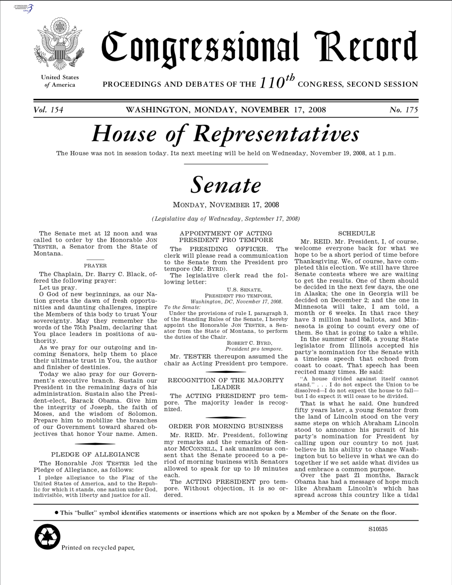
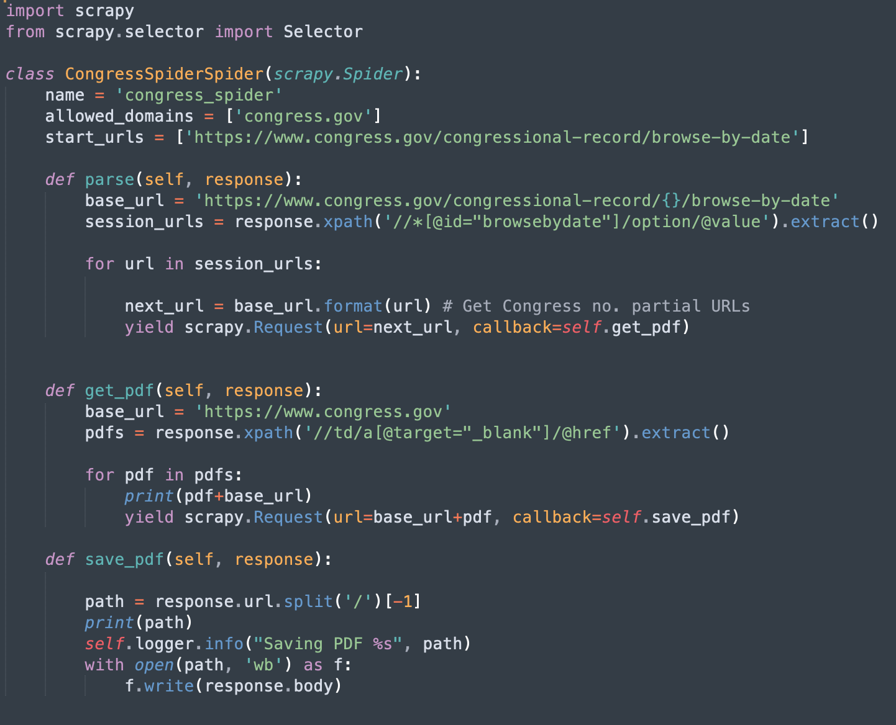
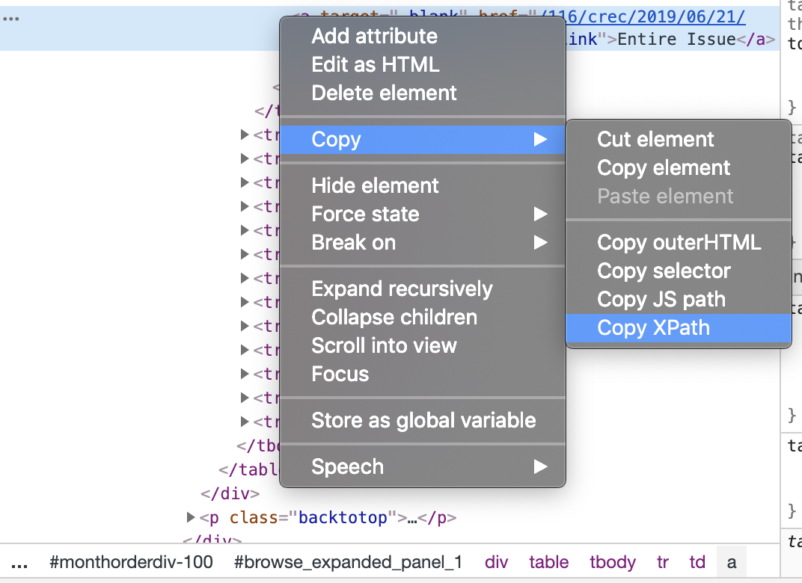
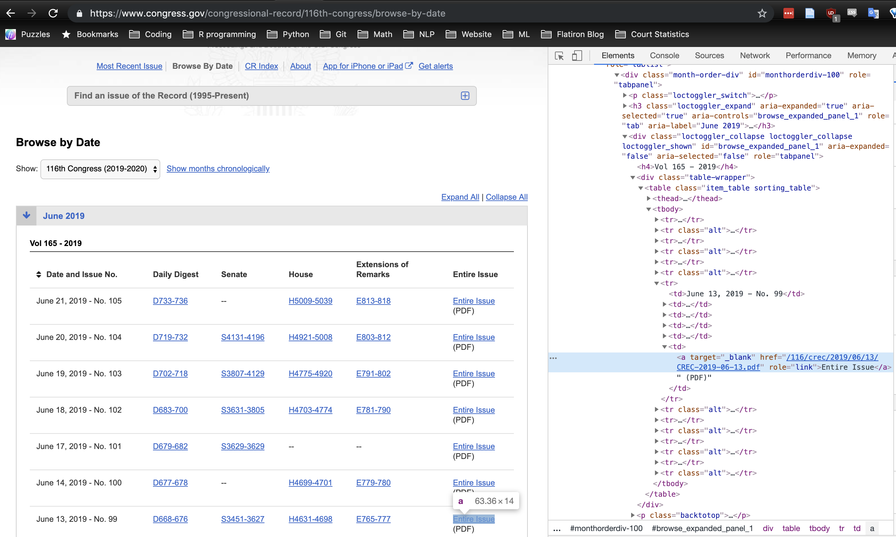
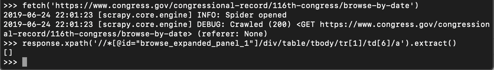
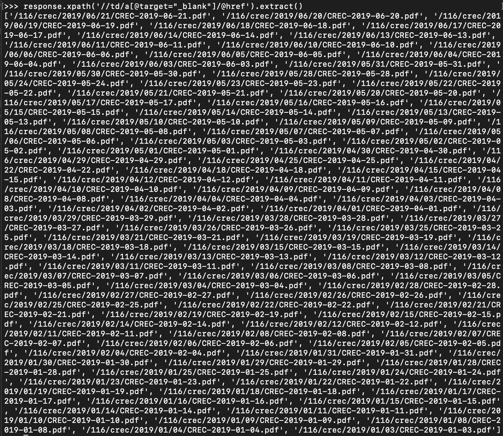
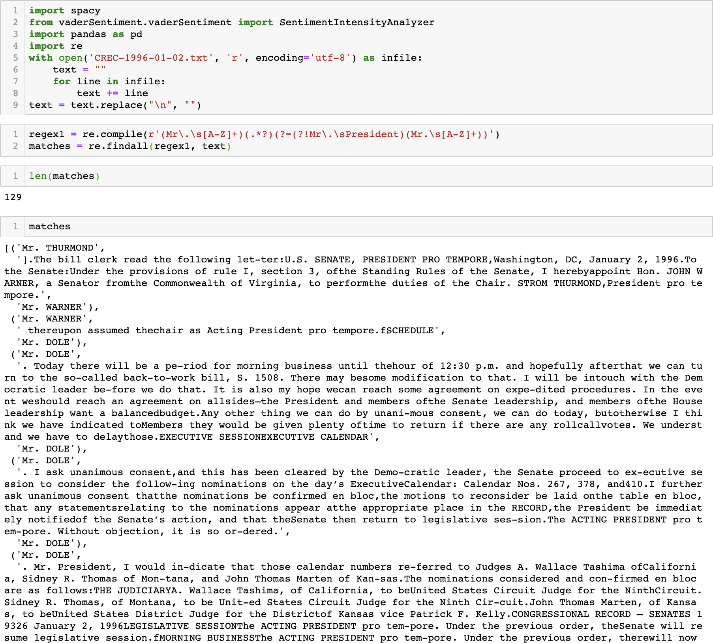
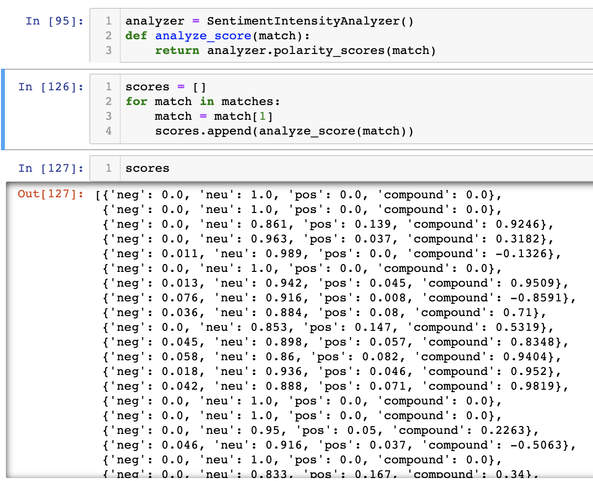

# Political Python
## _Scraping Congressional documents with Scrapy_

<figure style="width: 400px">
	
	<figcaption>_No, not this kind of python._</figcaption>
</figure>

The 2020 Democratic candidates for President will face off in debates starting Wednesday. [Many of them](https://www.washingtonpost.com/politics/2019/05/17/which-candidates-have-made-democratic-debate-stage/?utm_term=.a739a1f8a25a) are current or former members of Congress. All of them are vying to lead the country.

As voters, wouldn't it be extraordinary if we had a record of everything that they had said on the floor of the Senate or the House, over the course of their careers as politicians?  

And as data scientists, wouldn't we like to extract their words, analyze them, and use them to make judgments or predictions about these Congresspeople as Presidential candidates?

## Building a Spider with Scrapy

Yes, we can. The Constitution requires Congress to keep a journal of its proceedings. The Government Publishing Office thus prints (and digitally posts) the Congressional Record, which contains the daily official proceedings of the legislature's two chambers, including:
+ The House section
+ The Senate section
+ Extensions of Remarks (speeches, tributes, testimony, and legislative history)
+ The Daily Digest

<figure style="width: 400px">
	
	<figcaption>_Congressional Record, Monday, November 17, 2008._</figcaption>
</figure>

Although the data live in the public domain, getting them out of the website and into a usable format poses a bit of a challenge. Without access to pricy legal databases, web scraping is the best option for an enterprising member of the public, and Scrapy makes it relatively painless to get a lot of information quickly.

## The Spider Goes to Washington

 Scrapy allows for asynchronous web scraping with python. You can use it to extract data using APIs, integrate it with BeautifulSoup and Selenium, and extend its capabilities in as many ways as a spider web has filaments.

 Scrapy's central conceit is ~~copying [Django](https://www.djangoproject.com/)~~ a "don't repeat yourself" framework, meaning it provides a way to reuse code and easily scale projects up to a larger scope. The component parts of the crawler, such as the items, middlewares, pipelines, and settings, live in separate scripts, and multiple "spiders" that crawl different websites can use them within the same "project".

 The spiders themselves, naturally, rely on object-oriented programming (each is of the class "Spider"):

 <figure style="width: 400px">
 	
 	<figcaption>_A Scrapy spider._</figcaption>
 </figure>

 The vital components are:
 + The start URLs
 + What you extract from the response, and how
 + What you yield back to the parse function

## Using XPath with Python

One of Scrapy's most useful features is the Scrapy shell, which allows you to explore the website you are scraping in real time to test your assumptions. Essentially, you get to try your code out in sandbox mode before you deploy it (and find out it doesn't work).

When you're working with something as complex as XPath, this addition vastly reduces the time and frustration of drilling down into the structure of a website to extract the content you need. For instance, I needed to fetch partial URLs and text from particular elements within the HTML on the Congress.gov website. The Scrapy shell let me ensure my XPath syntax did not return empty lists before I copied and pasted the resultant syntax into my code.

<figure style="width: 400px">
	
	<figcaption>_Is it worth auto-generating XPath?_</figcaption>
</figure>


**A note on "copy XPath" from DevTools:** While you may find it enticing to simply right-click on an HTML element in DevTools and select "Copy XPath" from the menu that appears, do not succumb to temptation. If, like Congress, your site is organized in tables, you'll fail to retrieve everything you want. In my case, the PDFs I wanted are located in the far right column of the page:

<figure style="width: 400px">
	
	<figcaption>_Congress.gov website_</figcaption>
</figure>

Clicking "Copy XPath" gives me the following:
```
//*[@id="browse_expanded_panel_1"]/div/table/tbody/tr[1]/td[6]/a
```
_This is just describing a position within a table._

Here's what that returns in the shell:

<figure style="width: 400px">
	
	<figcaption>_An empty list_</figcaption>
</figure>

Here's what my _actual_ XPath expression is:

```
response.xpath('//td/a[@target="_blank"]/@href').extract()
```
And here's what it returns, for a given page:

<figure style="width: 400px">
	
	<figcaption>_PDFs that exist_</figcaption>
</figure>

You must [learn to use XPath](https://www.guru99.com/xpath-selenium.html) to select the _meaningful_ content, rather than rely on automatically generated expressions, which––rather like the governmental body in question––often table function in favor of form.

## Extracting Text with Tika

Once I had written the spider, it wasted remarkably little time in downloading 25 years' worth of the Congressional Record to my hard drive. Not too much additional code later, and I had extracted the text with [Tika](https://github.com/chrismattmann/tika-python), a python library that processes PDFs.

I created a regular expression to split out individual speeches:

<figure style="width: 400px">
	
	<figcaption>_Preliminary NLP pre-processing_</figcaption>
</figure>

And tried out some very preliminary sentiment analysis:

<figure style="width: 400px">
	
	<figcaption>_Preliminary NLP with VADER_</figcaption>
</figure>

## Mr. Speaker, Yield Your Secrets

What's next for Congress, now that their words are laid bare? Analysis and data mining, Natural(Language Processing)ly. While much ado has been made about Twitter, hardly a covfefe has yet been raised about what Senators and Representatives have said on the floor of Congress, whether because of the difficulty of obtaining the data, the trickiness of training the models, the lack of legal literacy, or all of the above. But with the proper tools and domain knowledge, I hope to provide some valuable insights ahead of the 2020 election season.
